# AWS for Fluent Bit Monitoring using EMF Filter [Experimental]
AWS for Fluent Bit supports monitoring Fluent Bit via CloudWatch EMF metrics when used alongside an experimental custom Lua Filter. Follow the instructions below to get started.

Please note that this Lua script plugin is experimental, provided as is, and there is no plan for future updates.

## Getting Started with Monitoring Fluent Bit 

Download the EMF lua script from this repository and add it to your aws-for-fluent-bit image. Add the following configuration blocks to the Fluent Bit logging configuration files. Update the `lua` filter’s section’s script to reference the lua script, along with region in the `cloudwatch_logs` output block.

```
[SERVICE]
    # Add the following to Service Configuration
    HTTP_Server  On
    HTTP_Listen  0.0.0.0
    HTTP_PORT    2020
    STORAGE.METRICS On

# Configure FB to scrape its metrics
[INPUT]
    Name exec
    Command echo "{\"flb_metrics\":$(curl -s http://127.0.0.1:2020/api/v1/metrics),\"storage\":$(curl -s http://127.0.0.1:2020/api/v1/storage)}"
    Interval_Sec 1
    Tag flb_metrics

[FILTER]
    Name lua
    Match flb_metrics
    Script <path-to>/aws-for-fluent-bit-monitoring-metrics_1_0_0.lua
    Call to_emf

[OUTPUT]
    Name cloudwatch_logs
    log_format json/emf
    Match flb_metrics
    log_stream_prefix ${HOSTNAME}
    log_group_name fluent-bit-metrics-emf
    auto_create_group true
    region <region>
```

Build and run Fluent Bit, and experience the default EMF monitoring behaviors.

#### Configuration via Environment Variables

If customization is desired, pass monitoring EMF metric configuration through environment variables. All environment variables are not required, and can be set via Docker Image ENV, custom entry point, or the environment variable section of the ECS Task Definition:

|Environment Variable	|&nbsp;&nbsp;&nbsp;&nbsp;&nbsp;&nbsp;&nbsp;&nbsp;&nbsp;&nbsp;&nbsp;&nbsp;&nbsp;&nbsp;&nbsp;&nbsp;&nbsp;&nbsp;&nbsp;&nbsp;&nbsp;&nbsp;&nbsp;&nbsp;&nbsp;&nbsp;&nbsp;&nbsp;&nbsp;&nbsp;&nbsp;&nbsp;&nbsp;&nbsp;&nbsp;&nbsp;&nbsp;&nbsp;&nbsp;&nbsp;&nbsp;&nbsp;&nbsp;&nbsp;&nbsp;&nbsp;&nbsp;&nbsp;&nbsp;&nbsp;&nbsp;&nbsp;**Type**&nbsp;&nbsp;&nbsp;&nbsp;&nbsp;&nbsp;&nbsp;&nbsp;&nbsp;&nbsp;&nbsp;&nbsp;&nbsp;&nbsp;&nbsp;&nbsp;&nbsp;&nbsp;&nbsp;&nbsp;&nbsp;&nbsp;&nbsp;&nbsp;&nbsp;&nbsp;&nbsp;&nbsp;&nbsp;&nbsp;&nbsp;&nbsp;&nbsp;&nbsp;&nbsp;&nbsp;&nbsp;&nbsp;&nbsp;&nbsp;&nbsp;&nbsp;&nbsp;&nbsp;&nbsp;&nbsp;&nbsp;&nbsp;&nbsp;&nbsp;&nbsp;&nbsp; |Default	|Example	|&nbsp;&nbsp;&nbsp;&nbsp;&nbsp;&nbsp;&nbsp;&nbsp;&nbsp;&nbsp;&nbsp;&nbsp;&nbsp;&nbsp;&nbsp;&nbsp;&nbsp;&nbsp;&nbsp;&nbsp;&nbsp;&nbsp;&nbsp;&nbsp;&nbsp;&nbsp;&nbsp;&nbsp;&nbsp;&nbsp;&nbsp;&nbsp;&nbsp;&nbsp;&nbsp;&nbsp;&nbsp;&nbsp;&nbsp;&nbsp;&nbsp;&nbsp;&nbsp;&nbsp;&nbsp;&nbsp;&nbsp;&nbsp;&nbsp;&nbsp;&nbsp;&nbsp;Description&nbsp;&nbsp;&nbsp;&nbsp;&nbsp;&nbsp;&nbsp;&nbsp;&nbsp;&nbsp;&nbsp;&nbsp;&nbsp;&nbsp;&nbsp;&nbsp;&nbsp;&nbsp;&nbsp;&nbsp;&nbsp;&nbsp;&nbsp;&nbsp;&nbsp;&nbsp;&nbsp;&nbsp;&nbsp;&nbsp;&nbsp;&nbsp;&nbsp;&nbsp;&nbsp;&nbsp;&nbsp;&nbsp;&nbsp;&nbsp;&nbsp;&nbsp;&nbsp;&nbsp;&nbsp;&nbsp;&nbsp;&nbsp;&nbsp;&nbsp;&nbsp;&nbsp;	|
|---	|---    |---	|---	|---	|
|AWS_FLB_MONITORING_NAMESPACE	|string	|AWSForFluentBit/Monitoring	|AWS_FLB_MONITORING_NAMESPACE="FireLensEMF/CustomNameSpace"	|Set metrics namespace to a custom value. String type.	|
|AWS_FLB_MONITORING_DIMENSIONS	|Array<Array<string>>	|[[]]	|[["Cell","Realm"],["Realm"]]	|Customize metric dimensionsets. Array type. Outter array represents an array of dimensionsets. Each inner dimensionset is an array of strings. The strings are the dimension names which are added to each metric. Alias and PluginType will be appended to each listed dimension set. There is no way to remove Alias or PluginType.	|
|AWS_FLB_MONITORING_PROPERTIES	|{<br/> &ensp; [propertyName]: propertyValue<br/>}	|{}	|{"Cell":"xyz","Realm":"abc","MyMetric":1}	|Add static values to set dimension or metric. Map type. Key represents the property name, value represents the property value. 	|
|AWS_FLB_MONITORING_METRICS	|{<br/> &ensp; "name": string, <br/> &ensp; "rateWindow?: number, <br/> &ensp; "storageResolution"?: number, <br/> &ensp; "suffix"?: string, <br/> &ensp; "remove"?: boolean <br/> &ensp;}[]	|{}	|[{"name": "logging_memory_total", "unit":"Bytes"}]	|Add, modify configuration, and remove EMF monitoring metrics. See below for futher clairificaiton.	|

#### Properties Configuration [AWS_FLB_MONITORING_PROPERTIES]

Properties are defined for setting the value of a constant dimension or metric. If a dimension set is defined, values should be added via properties, or listed on the source flb_metric log — see examples below for more information on either use case. 

```
AWS_FLB_MONITORING_DIMENSIONS=[["cell", "realm" ], [ "realm" ]],
AWS_FLB_MONITORING_PROPERTIES={
        "cell": "xyz",
        "realm": "abc",
        "container_memory_limit": 5 
},
AWS_FLB_MONITORING_METRICS=[
    {
        "name": "container_memory_limit" // use the default's, i.e. no window, 300s resolution
    }
]
```

Properties for dimensions and metrics can also be sourced from default metrics derived from the exec field of the source log, as well as from properties along side the exec field in the source log. Properties are sourced in the following order:

1. Derived metrics from the “exec” field
2. Static properties in the monitoring configuration JSON
3. Datasource log properties, alongside the “exec” field in the flb_metrics log (e.g. TaskID, ContainerID)

#### Metrics Configuration [AWS_FLB_MONITORING_METRICS]

The “AWS_FLB_MONITORING_METRICS” environment variable is an array of objects which configure, add, and remove a metric. See below for examples on how to use. The following table lists descriptions of the configuration object’s fields

|Field	|**Type**	|Unit	|Default	|Is Required	|Description	|
|---	|---	|---	|---	|---	|---	|
|name	|string	|	|	|TRUE	|Name of metric	|
|rateWindow	|number	|seconds	|300 and -1	|FALSE	|Sliding window in seconds for calculating rate. Rate is always per second, while window can be any multiple of a secod. -1 means no window processing. Defaults to 300 for rate metrics, -1 for for  non-rate. Added metric defaults to -1.	|
|storageResolution	|number	|seconds	|60	|FALSE	|EMF storage resolution	|
|suffix	|string	|	|"_per_second" and ""	|FALSE	|Adds on a suffix to the end of the original metric name. Defaults to "_per_second" for rate metrics. "" otherwise	|
|remove	|boolean	|	|FALSE	|FALSE	|Remove the listed metric	|

#### Dimensions Configuration [AWS_FLB_MONITORING_DIMENSIONS]

The “AWS_FLB_MONITORING_DIMENSIONS” environment variable is an array of dimension sets. Each dimension set is an array of dimension string. Defining dimensions does not define the value of the dimension. Use a property to define the dimension’s value, or append a key value pair to the source log’s variable.

Dimension values are pulled from the following sources:

1. Static properties in the monitoring configuration JSON
2. Fields of the EMF data source log

See examples below for how to configure these options.

#### Example Task Definition

To do...

## Default Monitoring Metrics Table

The following metrics are included by default and are intended to be monitored via dashboard/alarms.

|**Metric Name**	|Reference Name	|Suffix (Default)	|Dimensions	|Source	|Type	|Unit (Default)	|Window (Default)	|	|
|---	|---	|---	|---	|---	|---	|---	|---	|---	|
|proc_records_per_second	|proc_records	|_per_second	|alias, plugin_type=output	|metrics.[plugin_type][alias]	|Number	|count	|300s	|	|
|proc_bytes_per_second	|proc_bytes	|_per_second	|alias, plugin_type=output	|metrics.[plugin_type][alias]	|Number	|bytes	|300s	|	|
|errors_per_second	|errors	|_per_second	|alias, plugin_type=output	|metrics.[plugin_type][alias]	|Number	|count	|300s	|	|
|retries_per_second	|retries	|_per_second	|alias, plugin_type=output	|metrics.[plugin_type][alias]	|Number	|count	|300s	|	|
|dropped_records_per_second	|dropped_records	|_per_second	|alias, plugin_type=output	|metrics.[plugin_type][alias]	|Number	|count	|300s	|	|
|retried_records_per_second	|retried_records	|_per_second	|alias, plugin_type=output	|metrics.[plugin_type][alias]	|Number	|count	|300s	|	|
|records_per_second	|records	|_per_second	|alias, plugin_type=input	|metrics.[plugin_type][alias]	|Number	|count	|300s	|	|
|bytes_per_second	|bytes	|_per_second	|alias, plugin_type=input	|metrics.[plugin_type][alias]	|Number	|bytes	|300s	|	|
|dropped_records_per_second	|dropped_records	|_per_second	|alias, plugin_type=filter	|metrics.[plugin_type][alias]	|Number	|count	|300s	|	|
|add_records_per_second	|add_records	|_per_second	|alias, plugin_type=filter	|metrics.[plugin_type][alias]	|Number	|count	|300s	|	|
|disk_chunks_total	|disk_chunks_total	|	|alias, plugin_type=input	|storage.input_chunks[alias].chunks	|Number	|count	|N/A (-1)	|	|
|disk_chunks_up	|disk_chunks_up	|	|alias, plugin_type=input	|storage.input_chunks[alias].chunks	|Number	|count	|N/A (-1)	|	|
|disk_chunks_down	|disk_chunks_down	|	|alias, plugin_type=input	|storage.input_chunks[alias].chunks	|Number	|count	|N/A (-1)	|	|
|disk_chunks_busy	|disk_chunks_busy	|	|alias, plugin_type=input	|storage.input_chunks[alias].chunks	|Number	|count	|N/A (-1)	|	|
|disk_size_approximate	|disk_size_approximate	|	|alias, plugin_type=input	|storage.input_chunks[alias].chunks.total * 2mb	|Number	|bytes	|N/A (-1)	|	|
|memory_overlimit	|memory_overlimit	|	|alias, plugin_type=input	|storage.input_chunks[alias].status.overlimit	|0 or 1	|?	|N/A (-1)	|	|
|memory_size	|memory_size	|	|alias, plugin_type=input	|storage.input_chunks[alias].status.mem_size	|Number	|bytes	|N/A (-1)	|	|
|memory_limit	|memory_limit	|	|alias, plugin_type=input	|storage.input_chunks[alias].status.mem_limit	|Number	|bytes	|N/A (-1)	|	|

## Metric Removal

If the above metrics are too many for your usecase,unused metrics can be removed with the `AWS_FLB_MONITORING_METRICS` remove flag.

## Sliding Windows

Windows allow for smooth rate calculations. If no window is set, then rate calculation may be noisy, and trigger alarms. Adding a window smooths the metric over a given period. By default window is set to 5 minutes. On startup, window will slowly expand from 0 to 5 minutes, and rate will be calculated based on the available data and window size.

Window size is set with the rateWindow parameter. If set to -1, sliding window is turned off for that metric, and the metric value is published without processing. See above table for default rateWindow values.

## Examples

The following configurations provide guidance on how to configure AWS for Fluent Bit monitoring via EMF

#### Default Monitoring Experience

The following shows the default experience of Fluent Bit monitoring without any customization via environment variables.

`Fluent Bit Configuration`

```
[SERVICE]
    # Add the following to Service Configuration
    HTTP_Server  On
    HTTP_Listen  0.0.0.0
    HTTP_PORT    2020
    STORAGE.METRICS On

# Configure FB to scrape its metrics
[INPUT]
    Name exec
    Command echo "{\"flb_metrics\":$(curl -s http://127.0.0.1:2020/api/v1/metrics),\"storage\":$(curl -s http://127.0.0.1:2020/api/v1/storage)}"
    Interval_Sec 1
    Tag flb_metrics

[FILTER]
    Name lua
    Match flb_metrics
    Script <path-to>/fluent-bit-monitoring-metrics.lua
    Call to_emf

[OUTPUT]
    Name cloudwatch_logs
    log_format json/emf
    Match flb_metrics
    log_stream_prefix ${HOSTNAME}
    log_group_name fluent-bit-metrics-emf
    auto_create_group true
    region <region>
```

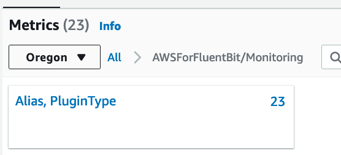
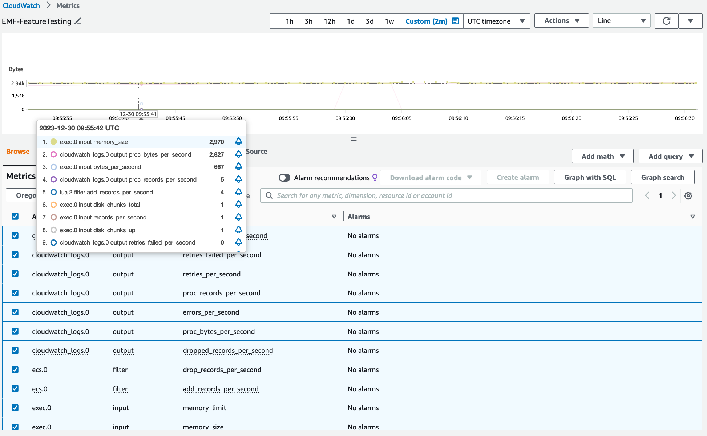

#### Customize Namespace

Namespace can be customized with the `AWS_FLB_MONITORING_NAMESPACE` variable

`Environment variables`

```
AWS_FLB_MONITORING_NAMESPACE="FireLensEMF/CustomNameSpace"
```

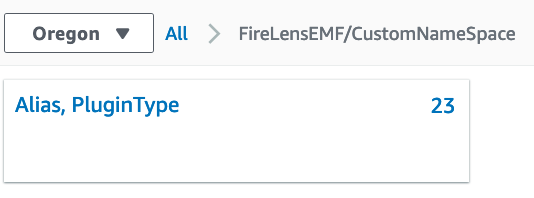
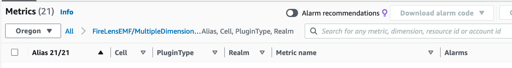


#### Add More Dimensions

Dimensions can be added to Monitoring metrics via setting `AWS_FLB_MONITORING_DIMENSIONS`, and `AWS_FLB_MONITORING_PROPERTIES` environment variables.

`Environment variables`

```
AWS_FLB_MONITORING_NAMESPACE="FireLensEMF/MultipleDimensions"
AWS_FLB_MONITORING_DIMENSIONS=[["Cell","Realm"],["Realm"]]
AWS_FLB_MONITORING_PROPERTIES={"Cell":"xyz","Realm":"abc"}
```

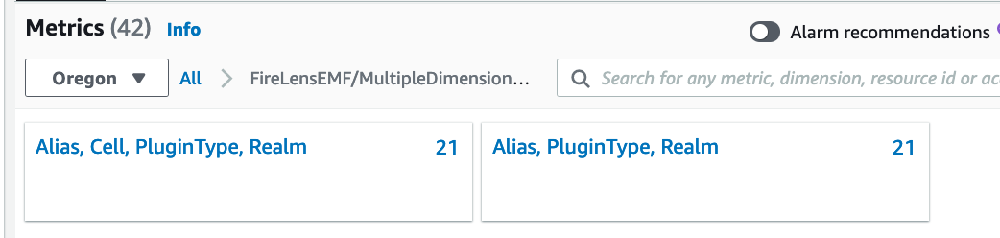

#### Add ECS Dimensions

ECS derived dimensions can be added to the monitoring metrics with an addition to the Fluent Bit configuration, as well as an update to the `AWS_FLB_MONITORING_DIMENSIONS` environment variable.

`Add to Fluent Bit configuration`

```
[FILTER]
    Name ecs
    Match flb_metrics
    ADD ClusterName $ClusterName
    ADD TaskDefinitionFamily $TaskDefinitionFamily
    ADD ContainerInstanceARN $ContainerInstanceARN
    ADD ContainerID $ContainerID
    ADD TaskID $TaskID
    ADD TaskARN $TaskARN
```

`Environment variables`

```
AWS_FLB_MONITORING_NAMESPACE="FireLensEMF/ECSDimensions"
AWS_FLB_MONITORING_DIMENSIONS=[["ClusterName","TaskID","Cell"]]
AWS_FLB_MONITORING_PROPERTIES={"Cell":"xyz"}
```

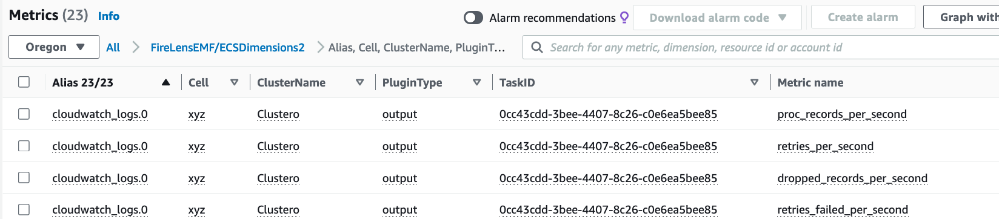

#### Custom Host Name Dimension

Host Name derived dimensions can also be added with a similar configuration to the  “Add ECS Dimensions” example.

`Add to Fluent Bit configuation`

```
[FILTER]
    Name record_modifier
    Match flb_metrics
    Record HostName ${HOSTNAME}
```

`Environment variables`

```
AWS_FLB_MONITORING_NAMESPACE="FireLensEMF/HostNameDimension"
AWS_FLB_MONITORING_DIMENSIONS=[["HostName","Cell"]]
AWS_FLB_MONITORING_PROPERTIES={"Cell":"xyz"}
```

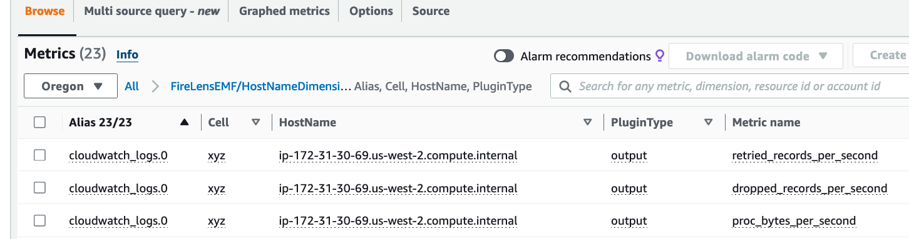

#### Add Static/Explicit Metric

Static metrics can be added to the namespace via an added property in `AWS_FLB_MONITORING_PROPERTIES` and a reference to that property via a new metric in `AWS_FLB_MONITORING_METRICS`

```
AWS_FLB_MONITORING_NAMESPACE="FireLensEMF/AddStaticMetric"
AWS_FLB_MONITORING_PROPERTIES={"logging_memory_total":10000000}
AWS_FLB_MONITORING_METRICS=[{"name": "logging_memory_total", "unit":"Bytes"}]
```

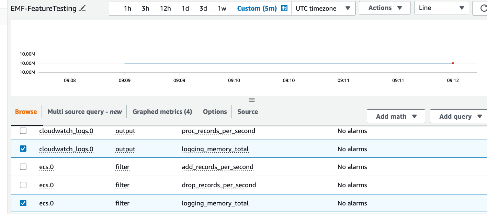

#### Set Existing Metric to Cumulative

Metrics which are set to rate mode by default can be toggled back to cumulative mode via a metric setting of rateWindow to -1. Name of the metric must be the metric name without the “_per_second” suffix. The “_per_second” suffix can be removed via the “suffix” metric configuration parameter.

`Environment variables`

```
AWS_FLB_MONITORING_NAMESPACE="FireLensEMF/CumulativeOverride"
AWS_FLB_MONITORING_METRICS=[{"name":"proc_records","suffix":"","rateWindow":-1}]
```

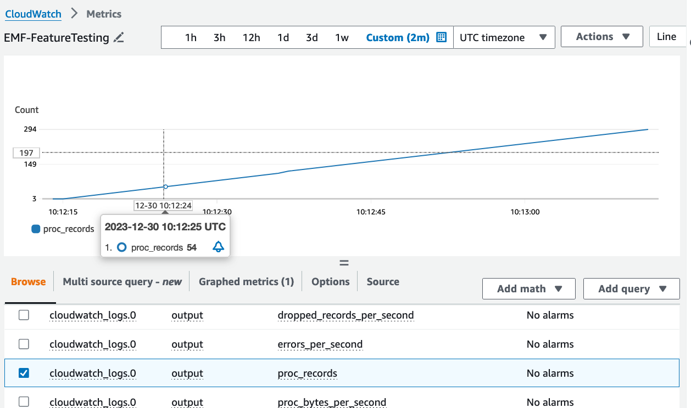
Explanation:

```
{"name":"proc_records","suffix":"","rateWindow":-1}
```

|Metric Setting	|Value	|Explanation	|
|---	|---	|---	|
|name	|proc_records	|Note that by default the metric name appears in CloudWatch as proc_records_per_second. This includes the original metric name from Fluent Bit  'proc_records' and the suffix `_per_second` which is added by default. The actual metric name which must be provided is the original metric name. Above is a list of the reference names in the metric table.	|
|suffix	|“”	|Removes the default '_per_second' suffix	|
|rateWindow	|-1	|-1 rateWindow means cumulative	|

#### Update Metric Configuration

Expand the `proc_records` rate window to average rate over 10 minutes and storageResolution to 1 second.

`Environment variables`

```
AWS_FLB_MONITORING_NAMESPACE="FireLensEMF/ExpandedRateWindow"
AWS_FLB_MONITORING_METRICS=[{"name":"proc_records","rateWindow":600,"storageResolution":1}]
```

Note that you must use the name of the metric without the “_per_seconds” suffix.
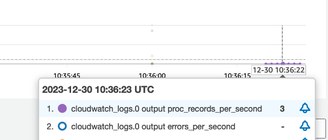

#### Remove Metrics

Remove metrics that are not important.

`Environment variables`

```
AWS_FLB_MONITORING_NAMESPACE="FireLensEMF/RemoveWastedMetrics"
AWS_FLB_MONITORING_METRICS=[{"name":"errors","remove":true},{"name":"add_records","remove":true}]
```

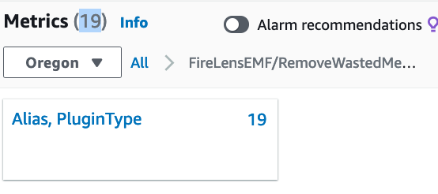
